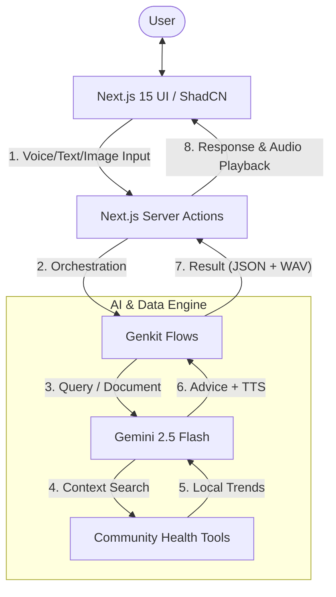

# Uzima Live | AI Health Assistant

Uzima Live is a real-time, multimodal AI health agent designed for the Uzima Mesh network. It provides personalized health guidance and medical document interpretation in both **English** and **Swahili**, leveraging Google's Gemini 2.5 Flash model via Genkit.

## 🌐 Live Demo

You can access the live application at: [https://studio--studio-9351178115-815ac.us-central1.hosted.app/](https://studio--studio-9351178115-815ac.us-central1.hosted.app/)

## 🏗️ Architecture

Uzima Live is built on a modern, serverless architecture that prioritizes speed, security, and multimodal processing.

### Data Flow
1.  **Input Collection**: The user provides input via the Voice Assistant (Web Speech API), Chat interface, or the Multimodal Document Scanner.
2.  **Serverless Orchestration**: Next.js Server Actions send the encrypted data to Genkit Flows.
3.  **Intelligent Processing**: Gemini 2.5 Flash analyzes the query or document (Multimodal Vision).
4.  **Grounding**: The AI uses internal tools to reference local community health trends (e.g., malaria outbreaks) to provide context-aware advice.
5.  **Multimodal Output**: Advice is generated in the target language (English/Swahili) and converted to high-quality audio via Gemini TTS.
6.  **Secure Purge**: Document data is purged from memory immediately after the interpretation is closed by the user.

## 🚀 Key Features

- **Voice Assistant**: Tap to speak your health concerns and receive spoken advice in your preferred language.
- **Interactive Chat**: Type symptoms or questions to get medically grounded guidance with full audio controls (Play/Pause/Stop).
- **Document Scanner (Vision)**:
    - Live camera scanning for medical documents (prescriptions, lab reports).
    - PDF upload support for detailed interpretation.
    - Automatic text-to-speech explanations of findings.
- **Multilingual Support**: Seamless switching between English and Swahili for all AI interactions and audio responses.
- **Privacy First**: Health documents are processed securely and document data is purged from memory immediately after interpretation.

## 🛠️ Tech Stack

- **Framework**: [Next.js 15](https://nextjs.org/) (App Router)
- **AI Orchestration**: [Genkit](https://firebase.google.com/docs/genkit)
- **LLM/Vision/TTS**: Gemini 2.5 Flash (via `@genkit-ai/google-genai`)
- **Audio Processing**: `wav` for PCM-to-WAV conversion.
- **Styling**: [Tailwind CSS](https://tailwindcss.com/) & [ShadCN UI](https://ui.shadcn.com/)
- **Icons**: [Lucide React](https://lucide.dev/)

## 🧪 Reproducible Testing Instructions

### 1. Voice Assistant Test
1. Select **English** from the language toggle.
2. Tap the **Mic** button. Say: *"I have been feeling very tired and have a slight fever."*
3. **Verify**: A response overlay appears with text and auto-plays audio. Test the **Pause** and **Stop** buttons.

### 2. Interactive Chat Test
1. Navigate to the **Chat** tab.
2. Type: *"What are the common signs of malaria?"* and click Send.
3. **Verify**: The AI assistant provides a response referencing local trends. Click the **Play** icon on the message bubble.

### 3. Document Scanner (Vision) Test
1. Navigate to the **Scan** tab.
2. **PDF Upload**: Click **Upload PDF** and select a medical report.
3. Click **Interpret**. **Verify**: The AI analyzes the document and provides a summary.
4. Close the overlay. A toast should confirm that data has been **Securely Cleared**.

## 🚦 Getting Started

### Prerequisites
- Node.js (v18 or later)
- Google AI (Gemini) API Key

### Installation
1. Install dependencies: `npm install`
2. Set `.env`: `GOOGLE_GENAI_API_KEY=your_api_key`
3. Run: `npm run dev`

## ⚖️ Disclaimer
Uzima Live is for informational purposes only and is **not** a substitute for professional medical advice. **In case of an emergency, contact local emergency services immediately.**